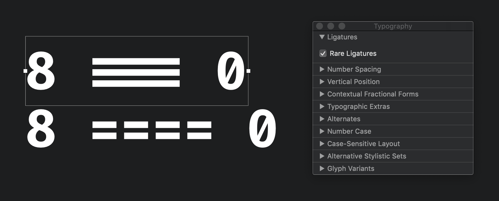
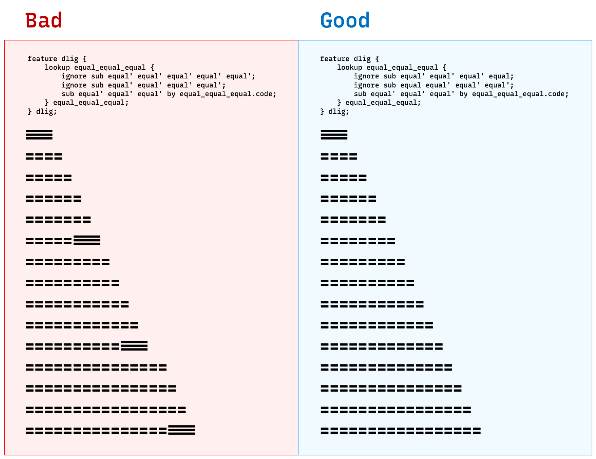

# Implementing Code Ligatures

There are three primary possible ways I see to implement code ligatures:

1. Emulate Fira Code: use `calt` to make code ligatures default, and let people disable them if they want to.
2. Use a `CODE` axis with alternates & GSUB set up in the designspace. This could be layered on top of the calt approach – it would have "invisible" composed ligatures by default, but more-connected, "code ligaturey" ligatures available when CODE gets turned up to 1.
3. Use `dlig`, checking that contextual control is still possible (This seems like the best way, per the OpenType spec).

## Fira Code, using DLIG instead of CALT

I asked @tonsky why Fira Code uses `calt`, when `dlig` may be more "by the book" for this type of feature (https://github.com/tonsky/FiraCode/issues/854). His initial reply was:

> I don’t remember exactly but one reason why I put them into calt instead of liga/dlig is because lookups or subs I use didn’t work in liga/dlig. Are they working ok for you?

With a quick test in a forked Fira Code file, these *do* seem to work if the feature code is moved from CALT to DLIG. Here is an image in Sketch:



(This font is stored at `docs/code-ligatures--implementation/assets/FiraCodeDLIG-Bold.otf`, and is made from the `dlig-test` branch of @thundernixon/firacode).


-----------------------------------------------------

## A closer look: how does Fira Code work?

At first look, Fira Code seems to have some pretty complicated OpenType feature code. It's actually relatively simple, though, once you understand a few aspects of it.

It does a pretty good job of a few things:
1. It *just works* in most places.
2. It avoids adding ligatures where they don't make sense. Example: `===` turns into a ligature, but `====` does not get any ligatures inside itself.
3. It allows the user to place their cursor "in the middle" of code ligatures, to edit them relatively easily.

Thign #1 (above): Fira Code *just works* because it uses the "contextual alternates" (`calt`) feature, which most environments turn on by default. If you are trying the OpenType spec closely, this is arguably something of a hack (but it probably makes sense in a single-purpose font like Fira Code).

Thing #2: it works because it uses OpenType "lookups." These go from bottom-to-top to allow a text renderer to make substitutions where needed, but nowhere else. For this, Fira Code uses blocks like this:

```
    lookup equal_equal_equal {                             # sets up a "lookup" for contextual awareness in substitutions
        ignore sub equal equal' equal equal;               # ignores an "equal" symbol in the second place of four
        ignore sub equal' equal equal equal;               # ignores an "equal" symbol in the first place of four
        sub LIG LIG equal' by equal_equal_equal.liga;      # adds ligature
        sub LIG  equal' equal  by LIG;                     # adds ligature
        sub equal'   equal  equal  by LIG;                 # adds ligature
    } equal_equal_equal;
```

Thing #3: it allows the user to easily place their cursor "inside" of ligatures. This is because it keeps the actual *drawing* of code ligatures to one unit of width, but substitutes blank glyphs (called `LIG`) in front of the drawn glyph. That's why there are three lines in the above code block to add in a single ligature.

@tonsky: 
> LIG is just an empty glyph, I invented the name for it myself. Why I need it is explained here https://www.patreon.com/posts/fira-code-inside-28074541.

----------------------------------


## Testing in Recursive

I'm starting in `src/features/features.fea`, which I can include in UFOs with syntax like `include(../../features/features.fea);` ([as per RoboFont docs](https://robofont.com/documentation/workspace/features-editor/#linking-to-external-feature-files)).

### Goal: make `===` turn into a ligature, but ignore strings like `====` with many `=` in a row.

This code does this:

```
feature dlig {
    lookup equal_equal_equal {
        ignore sub equal' equal' equal' equal, equal equal' equal' equal'; # if 'equal' is before or after the sequence, ignore the substitution
        sub equal' equal' equal' by equal_equal_equal.code;
    } equal_equal_equal;
} dlig;
```



Font in test: `docs/code-ligatures--implementation/assets/Recursive Mono-Linear B - DLIG test 100719 4.otf`

**Questions to answer:**

- How can I write this code in a central location then import it in?
  - 


- (Make separate issue): What other features need to be written to make this font work well?


## Resources

- http://adobe-type-tools.github.io/afdko/OpenTypeFeatureFileSpecification.html
- http://opentypecookbook.com/rules.html