# Recursive: Casual Mono - design & development notes, part 3

[ ] **be sure to copy in to-do items from** [+Recursive: Casual Mono - design & development notes, part 2](https://paper.dropbox.com/doc/Recursive-Casual-Mono-design-development-notes-part-2-PVx9AgIWQ6wZAcMhPhQFv) **and complete**

## Current questions

[+Top-of-mind questions about Recursive](https://paper.dropbox.com/doc/Top-of-mind-questions-about-Recursive-j06wvuYS5XqBvYS6puTeM) 

## Filling out the required glyph set
https://github.com/googlefonts/gftools/tree/master/Lib/gftools/encodings/GF%20Glyph%20Sets

## Character Set *(click to expand/collapse)*

Derived from Spectral, minus glyphs I know I won’t need in this round:

- cyrillic
- smallcaps
- oldstyle figures & symbols
- circled numbers, eighthnote

    A Agrave Aacute Acircumflex Atilde Adieresis Aring Amacron Abreve Aogonek Aringacute Adblgrave Ainvertedbreve Adotbelow Ahookabove Acircumflexacute Acircumflexgrave Acircumflexhookabove Acircumflextilde Acircumflexdotbelow Abreveacute Abrevegrave Abrevehookabove Abrevetilde Abrevedotbelow B C Ccedilla Cacute Ccircumflex Cdotaccent Ccaron Ccedillaacute D Dcaron Ddotbelow Dlinebelow E Egrave Eacute Ecircumflex Edieresis Emacron Ebreve Edotaccent Eogonek Ecaron Edblgrave Einvertedbreve Emacrongrave Emacronacute Ecedillabreve Edotbelow Ehookabove Etilde Ecircumflexacute Ecircumflexgrave Ecircumflexhookabove Ecircumflextilde Ecircumflexdotbelow F G Gcircumflex Gbreve Gdotaccent Gcommaaccent Gcaron Gmacron H Hcircumflex Hdotbelow Hbrevebelow I Igrave Iacute Icircumflex Idieresis Itilde Imacron Ibreve Iogonek Idotaccent Idblgrave Iinvertedbreve Idieresisacute Ihookabove Idotbelow J Jcircumflex K Kcommaaccent L Lacute Lcommaaccent Lcaron Ldotbelow Llinebelow M Mdotbelow N Ntilde Nacute Ncommaaccent Ncaron Ndotaccent Ndotbelow Nlinebelow O Ograve Oacute Ocircumflex Otilde Odieresis Omacron Obreve Ohungarumlaut Ohorn Oogonek Odblgrave Oinvertedbreve Odieresismacron Otildemacron Odotaccentmacron Otildeacute Otildedieresis Omacrongrave Omacronacute Odotbelow Ohookabove Ocircumflexacute Ocircumflexgrave Ocircumflexhookabove Ocircumflextilde Ocircumflexdotbelow Ohornacute Ohorngrave Ohornhookabove Ohorntilde Ohorndotbelow P Q R Racute Rcommaaccent Rcaron Rdblgrave Rinvertedbreve Rdotbelow Rlinebelow S Sacute Scircumflex Scedilla Scaron Scommaaccent Sdotaccent Sdotbelow Sacutedotaccent Scarondotaccent Sdotbelowdotaccent T Tcedilla Tcaron Tcommaaccent Tdotbelow Tlinebelow U Ugrave Uacute Ucircumflex Udieresis Utilde Umacron Ubreve Uring Uhungarumlaut Uogonek Uhorn Udblgrave Uinvertedbreve Utildeacute Umacrondieresis Udotbelow Uhookabove Uhornacute Uhorngrave Uhornhookabove Uhorntilde Uhorndotbelow V W Wcircumflex Wgrave Wacute Wdieresis X Y Yacute Ycircumflex Ydieresis Ymacron Ydotaccent Ygrave Ydotbelow Yhookabove Ytilde Z Zacute Zdotaccent Zcaron Zdotbelow Eth Oslash Oslashacute Thorn Dcroat Hbar IJ Ldot Lslash Eng OE Tbar Schwa uni01C4 uni01C7 Germandbls Omega Delta Ohm a agrave aacute acircumflex atilde adieresis aring amacron abreve aogonek aringacute adblgrave ainvertedbreve adotbelow ahookabove acircumflexacute acircumflexgrave acircumflexhookabove acircumflextilde acircumflexdotbelow abreveacute abrevegrave abrevehookabove abrevetilde abrevedotbelow b c ccedilla cacute ccircumflex cdotaccent ccaron ccedillaacute d dcaron ddotbelow dlinebelow e egrave eacute ecircumflex edieresis emacron ebreve edotaccent eogonek ecaron edblgrave einvertedbreve emacrongrave emacronacute ecedillabreve edotbelow ehookabove etilde ecircumflexacute ecircumflexgrave ecircumflexhookabove ecircumflextilde ecircumflexdotbelow f g gcircumflex gbreve gdotaccent gcommaaccent gcaron gmacron h hcircumflex hdotbelow hbrevebelow i igrave iacute icircumflex idieresis itilde imacron ibreve iogonek idblgrave iinvertedbreve idieresisacute ihookabove idotbelow j jcircumflex k kcommaaccent l lacute lcommaaccent lcaron ldotbelow llinebelow m mdotbelow n ntilde nacute ncommaaccent ncaron ndotaccent ndotbelow nlinebelow o ograve oacute ocircumflex otilde odieresis omacron obreve ohungarumlaut ohorn oogonek odblgrave oinvertedbreve odieresismacron otildemacron odotaccentmacron otildeacute otildedieresis omacrongrave omacronacute odotbelow ohookabove ocircumflexacute ocircumflexgrave ocircumflexhookabove ocircumflextilde ocircumflexdotbelow ohornacute ohorngrave ohornhookabove ohorntilde ohorndotbelow p q r racute rcommaaccent rcaron rdblgrave rinvertedbreve rdotbelow rlinebelow s sacute scircumflex scedilla scaron scommaaccent sdotaccent sdotbelow sacutedotaccent scarondotaccent sdotbelowdotaccent t tcedilla tcaron tcommaaccent tdotbelow tlinebelow tdieresis u ugrave uacute ucircumflex udieresis utilde umacron ubreve uring uhungarumlaut uogonek uhorn udblgrave uinvertedbreve utildeacute umacrondieresis udotbelow uhookabove uhornacute uhorngrave uhornhookabove uhorntilde uhorndotbelow v w wcircumflex wgrave wacute wdieresis x y yacute ydieresis ycircumflex ymacron ydotaccent ygrave ydotbelow yhookabove ytilde z zacute zdotaccent zcaron zdotbelow germandbls ae aeacute eth oslash oslashacute thorn dcroat hbar idotless ij kgreenlandic ldot lslash eng oe tbar uni01C6 uni01C9 uni01CC jdotless schwa mu pi uni01C5 uni01C8 uni01CB primemod doubleprimemod commaturnedmod apostrophemod ringhalfleft ringhalfright verticallinemod firsttonechinese secondtonechinese fourthtonechinese verticallinelowmod ordfeminine ordmasculine gravecomb acutecomb circumflexcomb tildecomb macroncomb brevecomb dotaccentcomb dieresiscomb hookabovecomb ringcomb hungarumlautcomb caroncomb dblgravecomb breveinvertedcomb commaturnedabovecomb horncomb dotbelowcomb dieresisbelowcomb commaaccentcomb cedillacomb ogonekcomb brevebelowcomb macronbelowcomb zero one two three four five six seven eight nine onesuperior twosuperior threesuperior onequarter onehalf threequarters zerosuperior foursuperior fivesuperior sixsuperior sevensuperior eightsuperior ninesuperior zeroinferior oneinferior twoinferior threeinferior fourinferior fiveinferior sixinferior seveninferior eightinferior nineinferior onethird twothirds oneeighth threeeighths fiveeighths seveneighths underscore hyphen hyphentwo figuredash endash emdash horizontalbar parenleft parenright bracketleft bracketright braceleft braceright numbersign percent perthousand quotesingle quotedbl quoteleft quoteright quotedblleft quotedblright quotesinglbase quotedblbase guilsinglleft guilsinglright guillemotleft guillemotright asterisk dagger daggerdbl period comma colon semicolon ellipsis exclam exclamdown question questiondown slash backslash fraction bar brokenbar at ampersand section paragraph literSign uni2116 periodcentered bullet minute second plus minus plusminus divide multiply equal less greater lessequal greaterequal approxequal notequal logicalnot arrowleft arrowup arrowright arrowdown partialdiff increment product summation micro divisionslash bulletoperator radical infinity integral whiterightpointingtriangle whiteleftpointingtriangle uni27F7 dollar cent sterling currency yen colonsign franc lira naira peseta won dong Euro florin kip peso guarani uni20B4 cedi uni20B8 rupeeIndian liraTurkish manat ruble asciicircum asciitilde acute grave hungarumlaut circumflex caron breve tilde macron dieresis dotaccent ring cedilla ogonek dieresisacute copyright registered trademark servicemark degree uni2117 estimated arrowupleft arrowupright arrowdownright arrowdownleft blacksquare whitesquare blackuppointingtriangle whiteuppointingtriangle uni25B4 uni25B5 blackrightpointingtriangle uni25B8 uni25B9 blackdownpointingtriangle whitedownpointingtriangle uni25BE uni25BF blackleftpointingtriangle uni25C2 uni25C3 blackdiamond whitediamond lozenge whitecircle blackcircle checkbox checkedbox heartsuitwhite heart check softhyphen zerowidthspace .null Jacute acutedotaccent blacktriangle breveacute brevegrave brevehookabove brevetilde carondotaccent circumflexacute circumflexgrave circumflexhookabove circumflextilde cyrbreve cyrbrevecomb dieresismacron dotaccentmacron idotaccent jacute macronacute macrondieresis macrongrave numero tildeacute tildedieresis tildemacron whitetriangle f_f fi fl f_f_i f_f_l caroncomb.alt periodcentered.loclCAT periodcentered.loclCAT.case gravecomb.case acutecomb.case circumflexcomb.case tildecomb.case macroncomb.case brevecomb.case dotaccentcomb.case dieresiscomb.case hookabovecomb.case ringcomb.case hungarumlautcomb.case caroncomb.case dblgravecomb.case breveinvertedcomb.case commaturnedabovecomb.case horncomb.case dotbelowcomb.case dieresisbelowcomb.case commaaccentcomb.case cedillacomb.case ogonekcomb.case brevebelowcomb.case macronbelowcomb.case hyphen.case endash.case emdash.case parenleft.case parenright.case bracketleft.case bracketright.case braceleft.case braceright.case guilsinglleft.case guilsinglright.case guillemotleft.case guillemotright.case slash.case backslash.case at.case exclamdown.case questiondown.case periodcentered.case acute.case grave.case hungarumlaut.case circumflex.case caron.case breve.case tilde.case macron.case dieresis.case dotaccent.case ring.case dieresisacute.case acutedotaccent.case breveacute.case brevegrave.case brevehookabove.case brevetilde.case carondotaccent.case circumflexacute.case circumflexgrave.case circumflexhookabove.case circumflextilde.case cyrbreve.case dieresismacron.case dotaccentmacron.case macronacute.case macrondieresis.case macrongrave.case tildeacute.case tildedieresis.case tildemacron.case zero.sinf one.sinf two.sinf three.sinf four.sinf five.sinf six.sinf seven.sinf eight.sinf nine.sinf zero.subs one.subs two.subs three.subs four.subs five.subs six.subs seven.subs eight.subs nine.subs zero.sups one.sups two.sups three.sups four.sups five.sups six.sups seven.sups eight.sups nine.sups zero.zero zero.slashLP zero.LP one.LP two.LP three.LP four.LP five.LP six.LP seven.LP eight.LP nine.LP .notdef

## Curvier italics & higher contrast throughout?

Yes! But only with some subtlety – too much looks clownish. This really improves the consistency of the inter-glyph aesthetics, and the curvier italic adds a nice extra layer of personality into the Casuals.

## Converting to Quadratics

Rough, so far. I‘ve used RF’s built-in converter, and while *that* seems to work well, it’s harder to avoid kinks with the shorter curve handles. 

[ ] scale to 2000 UPM, to hopefully assist drawing in quadratics

## Removing overlaps
- Rough. Takes a long time to re-find compatibility. 
- When contours have more points, it is harder, in some ways, to find compatibility problems.
- Still, it’s probably necessary to do for good rendering in the variable font

[ ] make script to move all overlapped contours to background layer
[ ] extend “curvier” aesthetics *after or while* removing overlaps in foreground layer (?) – because you shouldn’t waste time figuring out compatibility in shapes you won’t hold onto
    [ ] **ORRR increase curviness** ***before*** **adding inktraps**, so that future color fonts can be generated? Then, move to foreground, remove most overlaps, and add inktraps. Probably this.

## Sharpening Strict corners??

It is (seemingly) possible to go from round to sharp corners, by A) overlapping off-curve points, and B) make zero-length off-curve points. 

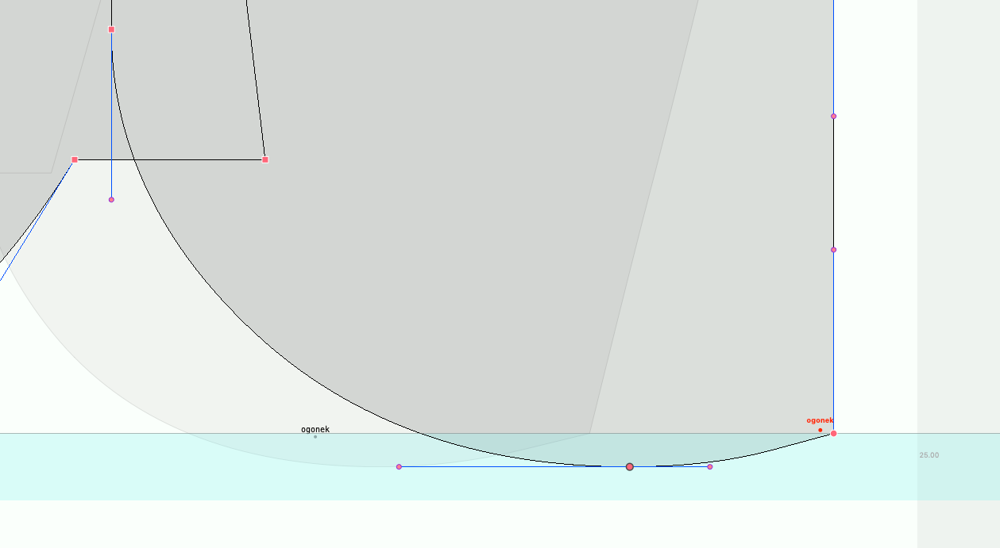

[ ] export test font w/ fontmake, to make sure this doesn’t block builds

**Advice from Christian Schwartz: “Don’t change it – just finish what you have. If you have more ideas, use them in the future.”**

## Italic Angle – reduce to 11.31?

If I use Skateboard to export of a preview UFO with a `slnt` of 11.31, I can see that the italic angle isn’t quite exactly 11.31 – instead, it’s 11.49.

This means that if I change to this more subtle angle, I will have to correct all the angles. Alternatively, if I keep to 14.04 degrees, I could simply set 14 as an “ExtraItalic” instance, and 11 (or maybe even 10 or 9) as the normal “Italic” instance. 

- Pros: This might better fit in with the idea of the font
- Cons: People would use this in large sizes and may show kinks in the interpolated italic

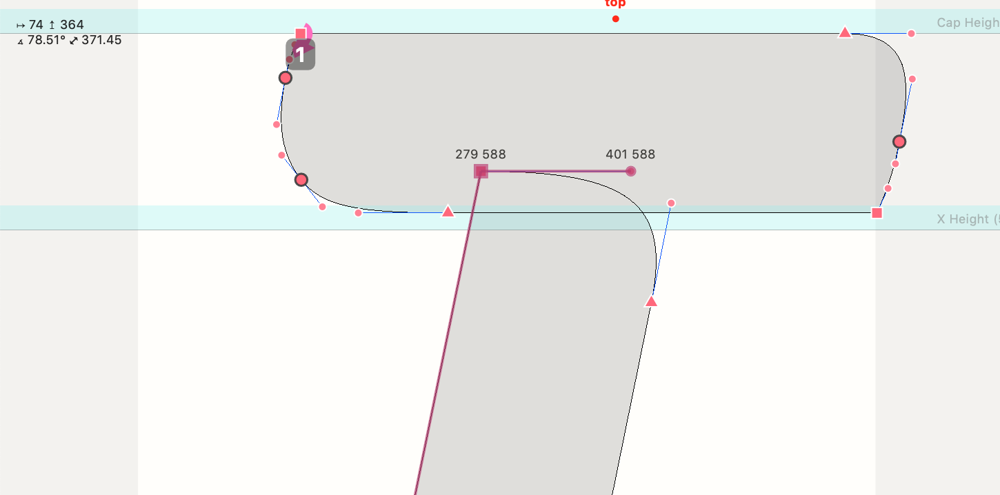

## Critique from Spencer Charles, April 15

- some letters are feeling a lot more curvy than others
    - a, n, m, h are very curvy, while s, c, o, e, y are not that curvy. 
    - try bringing the sharp little “kick” from the /a tail into letters like s, c, e, y to make them curvier

Notes to self

[ ] reduce curve of n, m, h, u by a bit
[ ] ? maybe flip the exit of the /t crossbar?
## April 15 – steps to making production files

[ ] test new italics in code (just exporting from cubics for now)
    [ ] re-find script to integrate corrected italics into artificial italics
    [ ] integrate corrections, then build just casual core family
    [ ] use in fontstack with vscode

**Testing Italic Casual – Process:**

1. Use Skateboard to generate “Preview” font
2. Use “remove-selected-glyphs-from-font.py” to remove empty glyphs, etc
3. Use fontmake to generate static regular & italic fonts
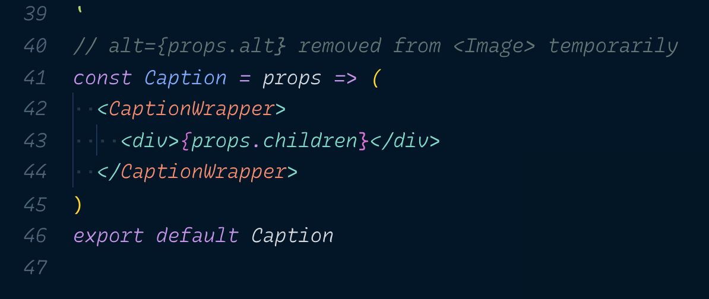

*Casual – about 11.31 degrees*

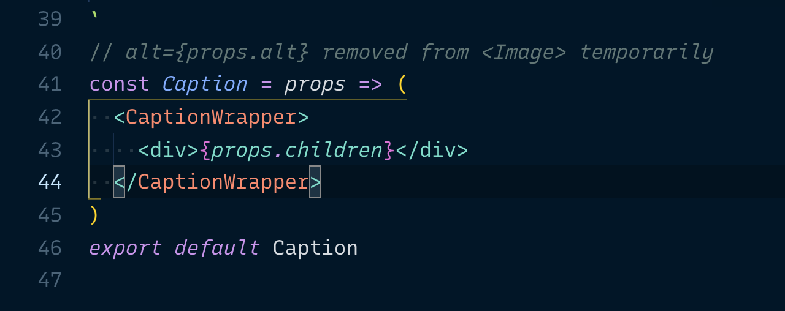

*Strict – 14 degrees*

**old vs curvier casual**
caveats:

- curvier casual is missing true-italic glyphs
- curvier casual is missing some glyphs entirely, which fallback to strict regular
- curvier casual is a bit lighter

Observations

- on an emotional level, the curviness is attractive
- the curviness comes with some serious challenges:
    - it’s harder to give a consistent visual slant – look at `mp` in succession
    - it’s harder to make strokes appear to match in weight – look at `d` and `p` vs `a`

*old casual (14°) vs curvier casual (11°)*

## Running a better test of italics
[ ] Make corrections of weight in curvy italics
    [ ] f, r, d, p, b, q stems are heavy
    [ ] s spine is too light in light master
    [ ] w is light (but maybe this is a bigger issue of master locations?)
[ ] generate curvier italic with same weight & true-italic characters
    [ ] set designspace to match (maybe go slightly under) original master weights
    [ ] re-find how to assert 

[ ] compare 14° slope to 11.31° in strict
[ ] convert to 2000 UPM
[ ] convert to quadratics
[ ] remove overlaps, etc

## April 17
[ ] **make release of beta v0.0.1** https://help.github.com/en/articles/creating-releases

## Strategy: moving to production files
1. Copy cubic files to quadratic folder
    1. copy foreground to background ([based on this script](https://robofont.com/documentation/building-tools/toolspace/scripts/scripts-font/#import-a-font-into-layer-of-the-current-font)?)
    2. convert paths to quadratic UFOs 
2. Use an updated varprep script to check for compatibility, create new UFOs of only-compatible glyphs, and *to not* decompose accents 
    1. should this be a command-line tool, rather than a RF script?
    2. should this allow for smaller ranges of glyphs to be specified (e.g. to test just a-z exporting, etc)
3. 

## More italic default /f?

Pros:

- flows into a curvy italic more nicely than the serifed f – works better than the form with bottom serif
- Could transition to italic without swapping forms
- possibly slightly more readable?

Cons:

- reduces eveness of monospace color
- reduces visual difference between sans & mono
- reduces visual difference between mono roman & italic (though, the ascender still grows nicely)

## Varfont prep

[+Improved varfont prep script](https://paper.dropbox.com/doc/Improved-varfont-prep-script-dCDL5cROvI23vV0NWLoDs) 

## Inktrap challenges between weights

Normally, ink traps keep fairly consistent between light and extrabold … but in the current `/v.italic`, it is moving at a different speed. 

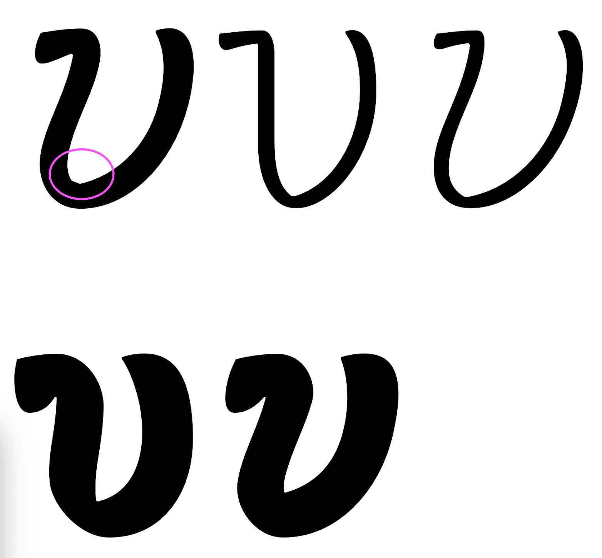

## Generating tests of italic

Process

1. Use Skateboard’s feature “Preview” to generate a UFO at `wght=450, slnt=11.31` and one at `wght=450, slnt=0.0`
2. Add a stylistic set to these to enable `.italic` characters.
3. Use `pyftfeatfreeze.py` to lock-in italic characters.
4. Use ttx to open the fonts, then update their names to `IterativeBetaV005`, adding nameID 16 & 17 (I think this may help with style linking in VSCode)
5. Add fonts to fontbook, then set as tests in VSCode

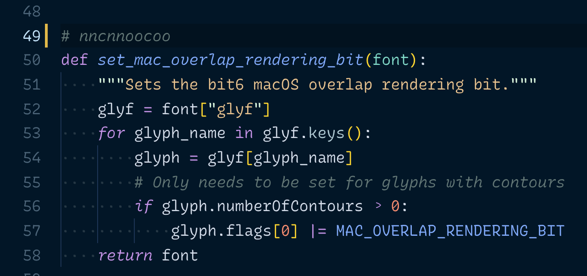

Observations

- ~~The lowercase~~ `~~c~~` ~~looks too wide~~
- ~~The~~ `~~d~~` ~~probably needs a tail~~
- The `y` is a bit heavy

**Round 2**

- adding little tops to /r, /c, & /s
- add tail to /d
- lower top of /i and /l slightly
- use 9.45° rather than 11.31

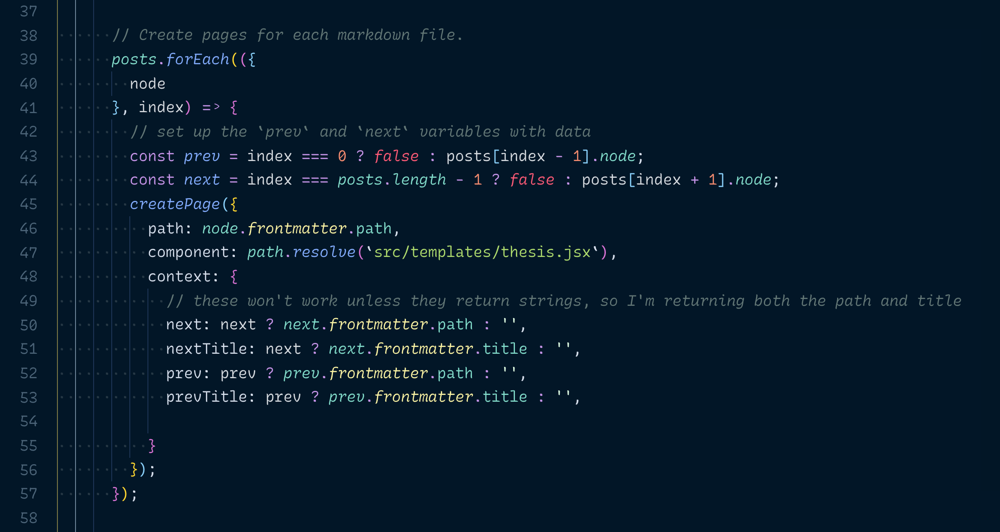

Observations

- YESSSS this looks nice
- the lower slant angle looks better in themes (like Night Owl) in which italics are heavily used
- the added bits really bring out a scriptyness in this

[x] top of /x needs to come down
[x] top of /r needs to come down
[x] top of /v needs to come down
[x] does top of /w really need a serif? maybe not… (no)

## Next questions to resolve in Italics

[x] Should letters get more narrow, to account for tails and keep spacing similar to roman? Or, should it just be a bit more like a “connected” script? (YES, slightly.)

## Spacing Italic characters

To make overall spacing work well with the roman styles, I spaced all “cursive” lowercase italics between the “roman” italic `n n` and `o o`. This made sure that the italics wouldn’t be visually too wide compared to romans, and that they would remain in the middle of their spaces.

    nnnooo/?oonn/?n/n.italic /?/n.italic/n.italic /i.italic /i.italic /?/i.italic/i.italic mm/?mm/m.italic/m.italic /?/m.italic/m.italic 

## Next work, April 24
[ ] check spacing in casual bold italic – may not be done yet
[x] smooth out top-left of `f.italic` – it’s currently too complex
[x] `z.italic` is too heavy

[ ] Start drawing interpolations to strict!
    [ ] test how the semicasual looks
[ ] resolve e ~~& c~~ from roman to italic – should these have roman-specific forms (with shorter exit strokes) that only swap in if ss02 is activated? 
    [x] yes, `c` should, so it can have a top notch
    [ ] unsure on e … it may not need it
[ ] start drawing test characters in heavy italics – strict and casual
[ ] start pulling in italic updates to caps

## I need to find/adapt/make a script to easily flip the current vectors in the background in different ways, to help achieve better symmetry

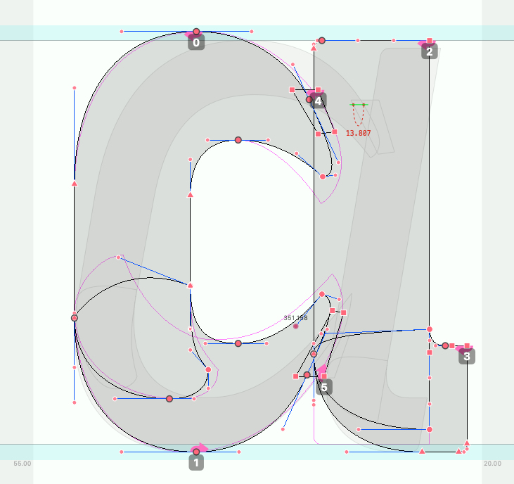

## Bottom curves on italics, or no?
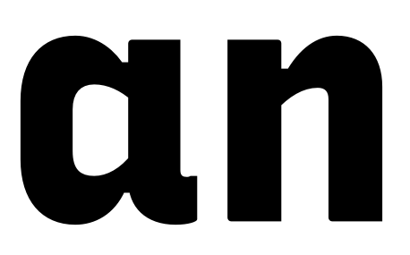

*curved bottom tail*

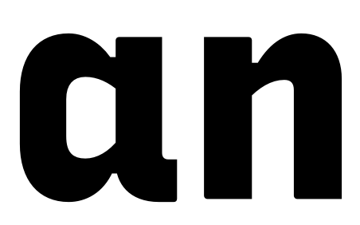

*flat bottom tail*

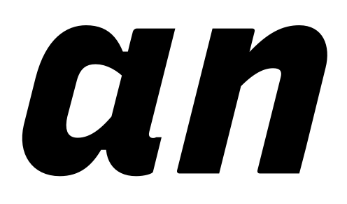

[ ] `z.italic` is still too heavy

## Finding symmetry (and visual symmetry) in Strict ExrtraBold

*When the /d joint is the same height as the /n joint, it looks too low*

*The joint in /d actually appears to match when it’s 10 units (of 1000) higher than the /n joint*

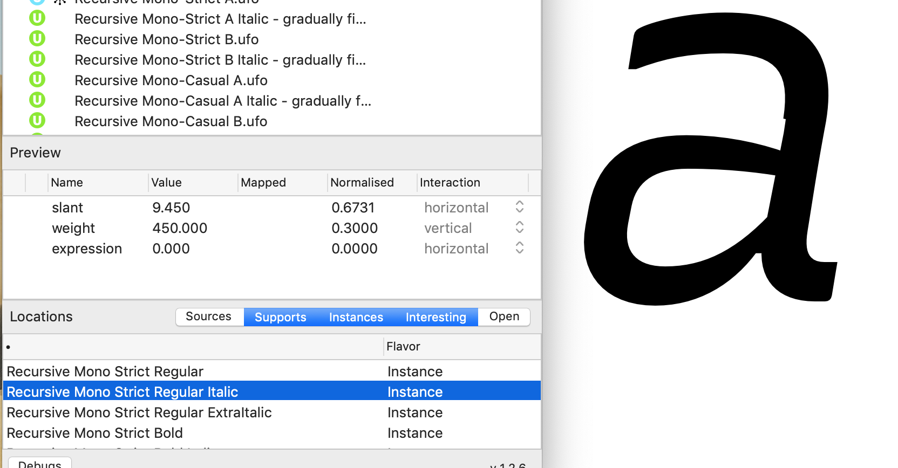

## Discussing compatibility table w/ Rafał for MasterTools extension, April 29
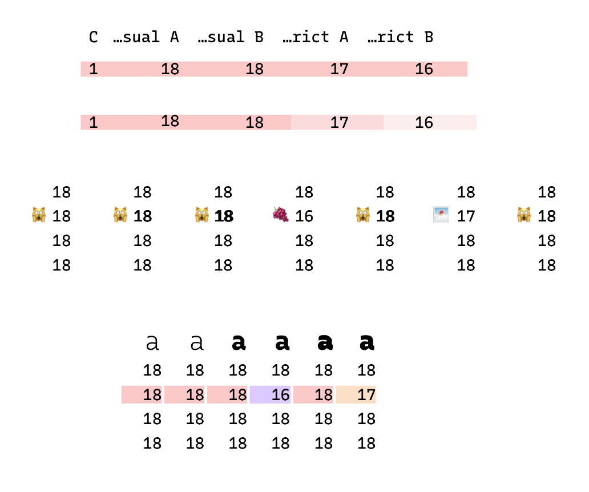

## Preparing to collaborate with Katja

Needs:

- italic upgrades worked into strict lowercase
- basic direction on heavy italics
    - inktraps and updates to heavy uprights (lowercase, at least)
        - (try `a` and `e` with lighter bowls)
    - test characters in heavy italics – at min, `a, e, o, n, v, g, s, r`
- record video to show method of drawing

How far to go with brush-stroke-based drawings?

- Possibly, to get new italic direction & “final” upgrades into caps, figs, and very basic symbols

ASAP:

- ~~!! Make script to copy overlapping contours to background layer, to preserve those but allow overlap removal~~
    - also see if you can make modified overlap function to no remove “extra” points ([asked on robofont forum](https://forum.robofont.com/topic/629/how-might-i-remove-overlap-in-contours-without-erasing-points-along-path/3))
- ~~copy new glyphs to strict masters~~
- test converting subset to quadratic curves
    - use varfont prep to make simple font with only-compatible glyphs, then convert this. Judge quality and go from there. 

First goals:

- finish monospace
    - draw heavy mono italic, casual & strict, with new `.italic` forms
    - make new accent marks & build w/ glyph construction
    - draw new currency symbols
    - remove overlaps and keep compatibility
- check back into collected to-dos, and check that they are fixed

Next goals

- move updates into sans
    - duplicate what can be duplicated
    - edit characters that are edited widths to match new edits (curves, inktraps, key overlaps removed)
    - kern

More written here: [+Recursive project notes for Katja](https://paper.dropbox.com/doc/Recursive-project-notes-for-Katja-eLDhTGUP0JNG7zgJt8LVa) 

[ ] make a script to check for expected distances of “little flat bits” on letters. E.g. always 20 in strict ExtraBold & Heavy; Always 6 units for casual styles, etc
[ ] 

[x] fix kink at bottom of `t`

## Letters which may need “intermediate masters” (really, probably just alternates which get swapped to)

[ ] /w gets too light in middle
[ ] /m is probably a bit thin at Regular
[ ] /k has an inktrap which is too wide

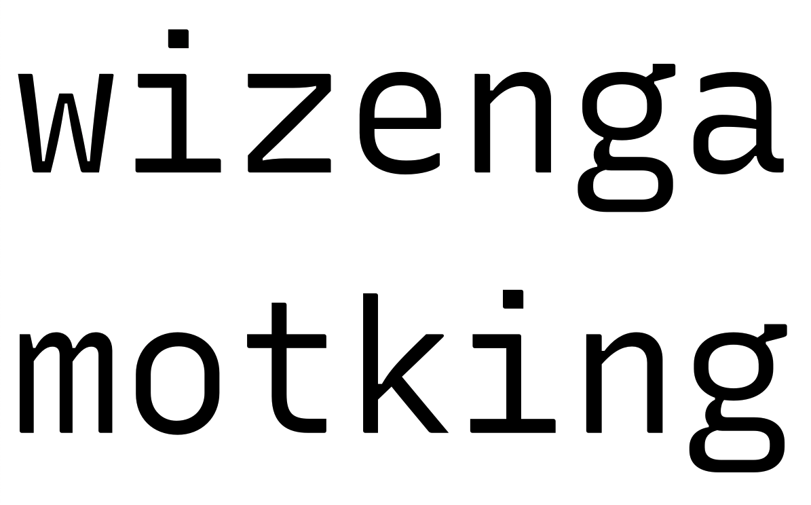

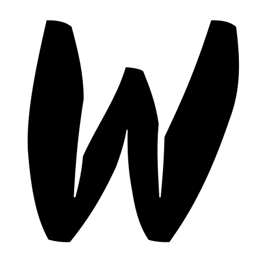

*Hilarious interpolation error, or perfect start of a display typeface? (has been resolved)*

## 
## Issues to fix, May 8
[ ] casual upright /y appears to lean backwards/leftwards – the right side could be a little less steep 

